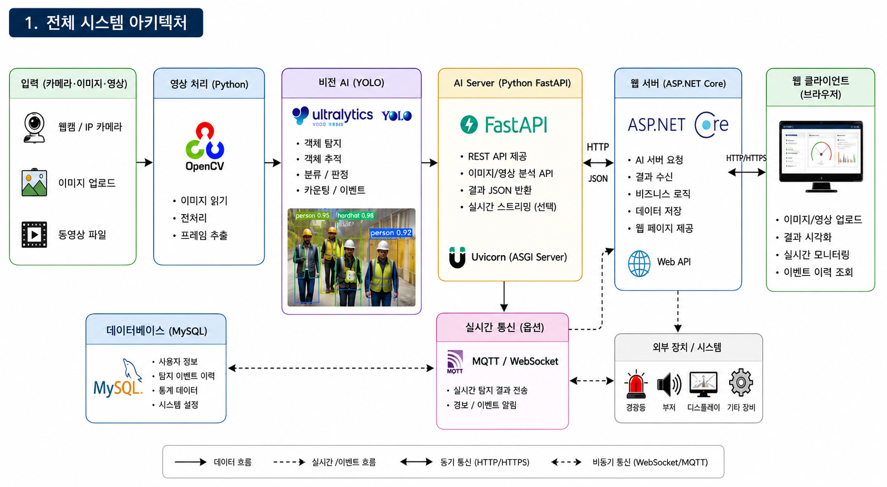
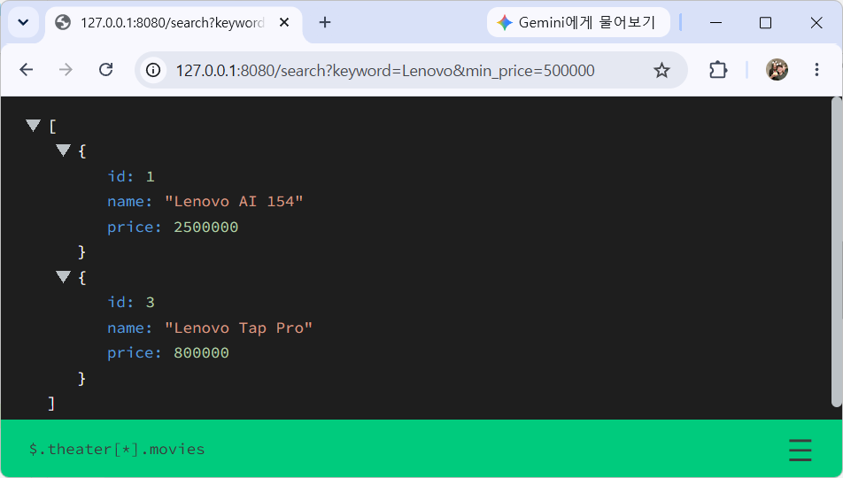

# 토이 프로젝트

출처 : 자바 스프링부트 프로젝트와 파이썬 AI 프로젝트 연결하기(허진경 / 부크크) 

## AI 비전검사 시스템



### Python WebAPI 서비스

- Python 웹 라이브러리/프레임워크
    - Flask - 가볍고 필요한 기능만 제공하는 소규모 프로젝트용 웹. 난이도 중
    - `FastAPI` - REST API에 최적화 된 웹. 매우 빠름, 난이도 중
    - Django - 모든 기능을 제공하는 대형 프레임워크. 난이도 상
    - Pyramid - 중대형 프로젝트용 프레임워크. 난이도 상
    - Falcon - REST API 전용
    - Bottle - 초경량. 난이도 하

- 웹 서버(실행 서버)
    - `Uvicorn` - FastAPI 실행 서버

#### 파이썬 가상환경 설치

- 프로젝트 경로까지 폴더 이동

```powershell
> python -m venv venv
> .\venv\Scripts\activate.ps1
```

- .gitignore에 python 관련 설정 추가

#### 기본 패키지 설치

```powershell
> pip install fastapi uvicorn
```

#### FastAPI 기본

- 기본 서버 : [소스](./toyproject/ToyProjects04/pythonAi/main01.py)

- 서버실행 1

```powershell
> fastapi dev main01.py
```

- `서버실행 2`

```powershell
> uvicorn main01:app --reload [--port 8000]
```


#### FastAPI docs

- Swagger UI - PostMan과 동일한 기능 웹페이지
- http://127.0.0.1:8000/docs
    
#### Get Method 처리 API 

- Get method : [소스](./toyproject/ToyProjects04/pythonAi/main02.py)

#### FastAPI 디버그모드

- 아래 코드 추가 후 디버깅 시작으로 실행
- 디버깅 가능

```python
import uvicorn

if __name__ == '__main__':
    uvicorn.run('main02:app', host='127.0.0.1', port=8000, reload=True)
```

#### 쿼리스트링

- URL 뒤 ?변수명=값&변수명=값 : [소스](./toyproject/ToyProjects04/pythonAi/main03.py)



#### Pydantic 모델 사용

#### Put 메서드 처리 API

### Python AI 물체인식

- OpenCV + PyTorch + YOLO

### ASP.NET Core WebAPI

### 연동

### 비전검사

