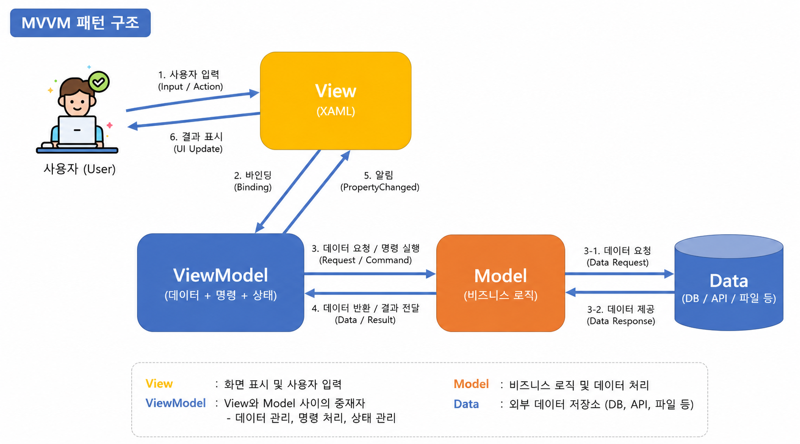
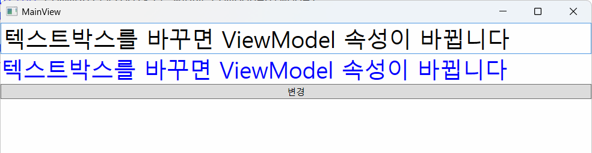
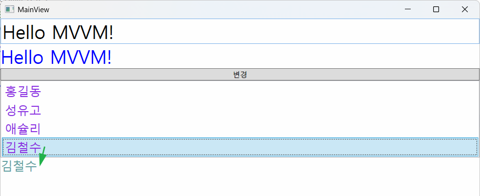

# 토이 프로젝트

## WPF MVVM 패턴 활용

### MVVM 패턴 개요

- MVC 패턴의 확장
    - C++, C# Winforms 예전 MVC 따로 사용
    - 팀으로 개발할 때 디자인 작업, 개발 작업 분리 공백을 줄이고자 
    - 유지보수 시 구분된 레이어만 수정하면 되는 장점
    - 단일 개발보다 구현이 쉽지 않음

- MVVM - Model - View - ViewModel
    - MVC 패턴과의 차이점 - Controller 대신인 ViewModel이 아니고 `View`가 대문이다
    - View에서 동작의 처리를 시작, **이벤트 핸들러가 모두 사라짐**
    - View에 해당하는 xaml.cs 파일에는 아무런 로직이 안들어감(디자이너는 로직을 생각지 말것)
    - 버튼, 키보드 이벤트가 모두 ViewModel로 넘어감 -> Command 
    - 디버깅이 조금 어려움(몇몇 상태는 디버깅이 안됨)



- MVVM 라이브러리 - 손쉽게 MVVM 구현을 도와주는 역할
    - `CommunityToolkit.Mvvm` - MS개발. 가장 일반적, 난이도 하
    - Prism - MS관련 개발. 중대형 비즈니스용. 난이도 상
    - Caliburn.Micro - 간단한 MVVM 패키지. 난이도 하
    - Avalonia - 크로스플랫폼용 MVVM. 난이도 중

### MVVM 초간단 예제

- CommunityToolkit.Mvvm 패키지 설치
- Models, Views, ViewModels 폴더(네임스페이스) 생성

#### Model 생성

```cs
namespace WpfMvvm01.Models {
    public class Person {
        public string Name { get; set; }
    }
}
```

#### ViewModel 생성

```cs
using CommunityToolkit.Mvvm.ComponentModel;

namespace WpfMvvm01.ViewModels {
    // Observable(객체내용 변경 추적)
    // MainViewModel이 다른 클래스와 합쳐져서 컴파일 됨
    public partial class MainViewModel : ObservableObject {
        [ObservableProperty]
        private string message = "안녕하세요";
    }
}
```

#### View 생성

- Views/MainView.xaml 생성

#### App.xaml 수정

- StartupUri 속성 삭제
- App.xaml.cs 생성자 추가

```cs
public App() {
    MainView view = new MainView();
    // MainView 객체의 전체데이터를 관장하는 DataContext에 ViewModel을 할당
    view.DataContext = new MainViewModel();
    view.Show();
}
```

#### MainView.xaml 수정

```xml
<TextBox FontSize="30" Text="{Binding Message}" />
```

- INotifyPropertyChanged 인터페이스 내 PropertyChanged 이벤트가 실행

#### 실행결과


#### ViewModel에 버튼클릭 로직 추가

- MVVM은 Click이벤트 사용 안함. 대신 Command 사용

```cs
public partial class MainViewModel : ObservableObject {
    ...

    [RelayCommand] // View에서 넘어온 명령을 처리
    private void ChangeMessage() {
        Message = "버튼 클릭!!!";
    }
}
```

#### View에 버튼 추가

- ViewModel의 RelayCommand 메서드명 + Command 입력 필수

```xml
<Button Content="변경" Command="{Binding ChangeMessageCommand}">
```

#### 실행결과


- View는 디자이너 작업 - UI 설계서에 따라 속성값만 Binding으로 입력
- ViewModel은 개발자 작업 - 속성은 ObservableProperty로 명령은 메서드(Command 제거)로 작성


#### 양방향 바인딩, View

- View에서 입력한 데이터를 ViewModel을 통해 Model로 전달하기 위해서 사용

```xml
<TextBox FontSize="30" Text="{Binding Message, UpdateSourceTrigger=PropertyChanged}" />
<TextBlock FontSize="30" Foreground="Blue" Text="{Binding Message}" />
```



#### ListView 데이터 바인딩

- ViewModel에 ObservableCollection 사용

```cs
public ObservableCollection<Person> People { get; } = [
    new Person { Name = "홍길동" },
    new Person { Name = "성유고" },
    new Person { Name = "애슐리" },
    new Person { Name = "김철수" },
];
```

- View에 ListView 컨트롤 추가

```xml
<ListView ItemsSource="{Binding People}">
    <ListView.ItemTemplate>
        <DataTemplate>
            <TextBlock Text="{Binding Name}" FontSize="20"  />
        </DataTemplate>
    </ListView.ItemTemplate>
</ListView>
```

- ViewModel에 선택항목 표시 속성

```cs
[ObservableProperty]
private Person? selectedPerson;
```

- View 선택항멱 표시 컨트롤 추가

```xml
<TextBlock FontSize="20" Foreground="CadetBlue" Text="{Binding SelectedPerson.Name}" />
```

- 실행화면




### 책대여 시스템 MVVM

#### 필요 패키지

- CommunityToolkit.Mvvm
- MahApps.Metro
- MahApps.Metro.IconPacks
- MySQLConnector
- NLog...

#### MahApp.Metro 디자인 지정

- App.xaml 추가

#### 패턴 폴더 생성

- Models, Views, ViewModels

#### MVVM 패턴에서 다이얼로그 처리

- MVVM 패턴에서 MahApps.Metro의,
    - this.ShowMessageAsync() 메서드 사용 불가
- MVVM 패턴에 맞춰서 설정

- App.xaml.cs에서 MainViewModel 객체 생성시 파라미터 추가

```cs
view.DataContext = new MainViewModel(DialogCoordinator.Instance);
```

- MainViewModel에 IDialogCoordinator 인터페이스 할당받는 생성자 추가

```cs
private readonly IDialogCoordinator _coordinator;

public MainViewModel(IDialogCoordinator coordinator) {
    title = "BookRentalShop v1.1";
    this._coordinator = coordinator; // App.xaml.cs에서 생성하면서 넘어온 파라미터를 초기화
}

// 메서드 내 사용법
[RelayCommand]
public async Task AppExit() {
    //MessageBox.Show("프로그램을 종료합니다.");

    await this._coordinator.ShowMessageAsync(this, "종료확인", "종료하시겠습니까?");
}
```

- MainView.xaml mah:MetroWindow 태그에 다이얼로그 속성 추가

```xml
<mah:MetroWindow x:Class="WpfMvvm02.Views.MainView"
        ...
        Title="{Binding Title}" Height="550" Width="1000"
        mah:DialogParticipation.Register="{Binding}">
```


