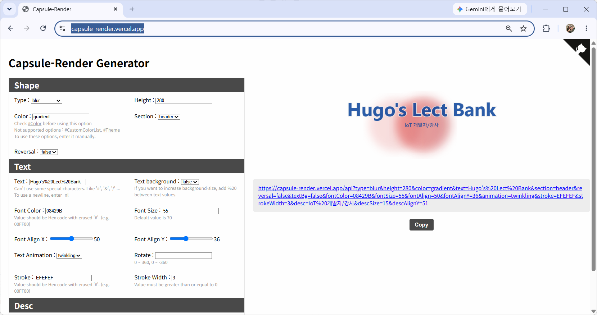
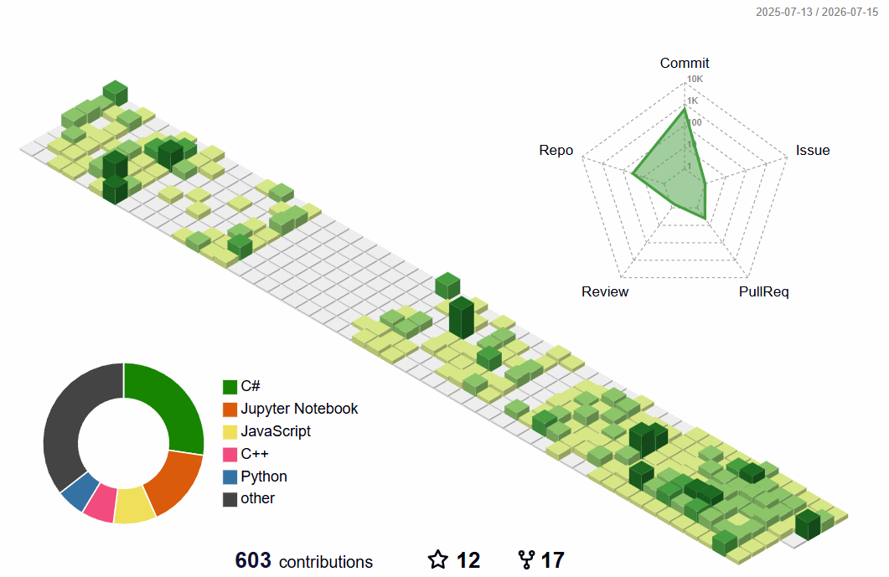
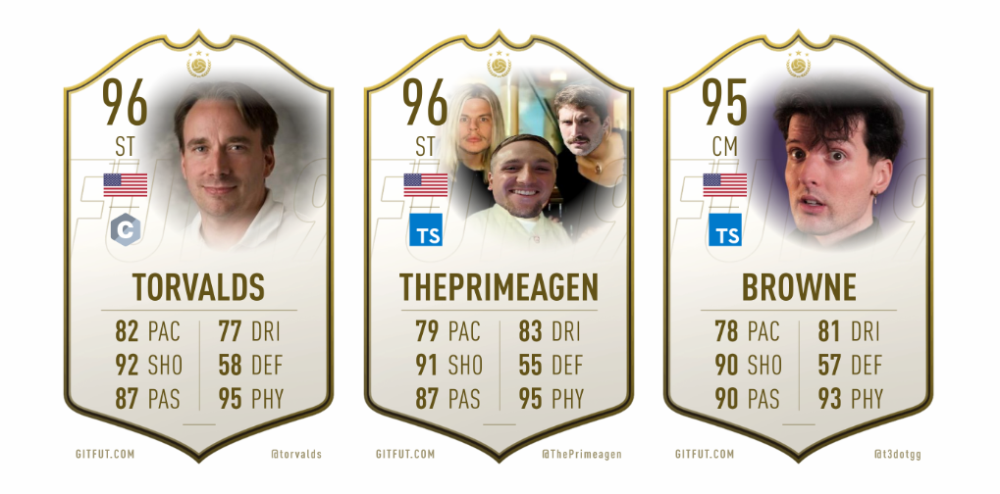
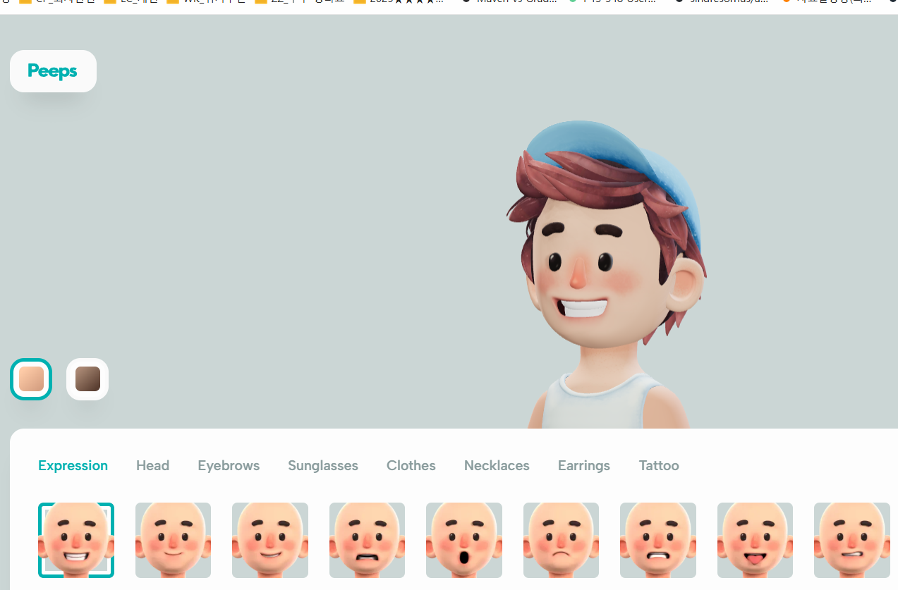

# 토이 프로젝트 3

## 깃허브 대문 작성

### 깃허브 리포지토리 생성

- 자신의 아이디와 동일한 이름으로 생성


### 캡슐 렌더 제너레이터 사용

- https://capsule-render.vercel.app/ 헤더이미지 생성



### 기본 프로필 작성

- 생략

### 기술스택 아이콘 

#### 방법 1

- https://icons8.com/ 사용 언어, 기술에 대한 아이콘 검색

#### 방법 2

- https://img.shields.io/docs/logos 사용방법
- https://simpleicons.org/ 에서 로고 이미지 검색

```html

```

- badge 뒤 기술명-아이디, logo 명을 https://simpleicons.org/ 에서 검색 후 변경


### 기술명세 

- 테이블로 생성

### Contribution 3D Graph

- https://github.com/yoshi389111/github-profile-3d-contrib



### 월드컵 스타일 뱃지

- https://github.com/Younesfdj/gitfut
- https://news.hada.io/topic?id=31418 



### 프로필 이미지

- https://peeps.ui8.net/

